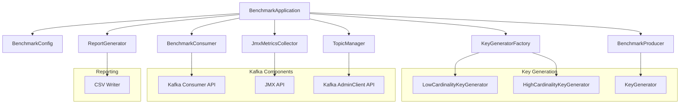
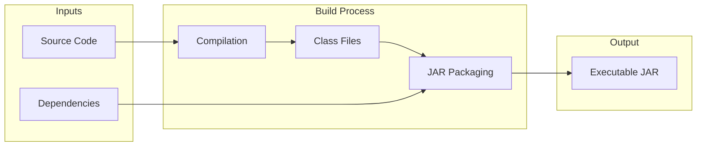
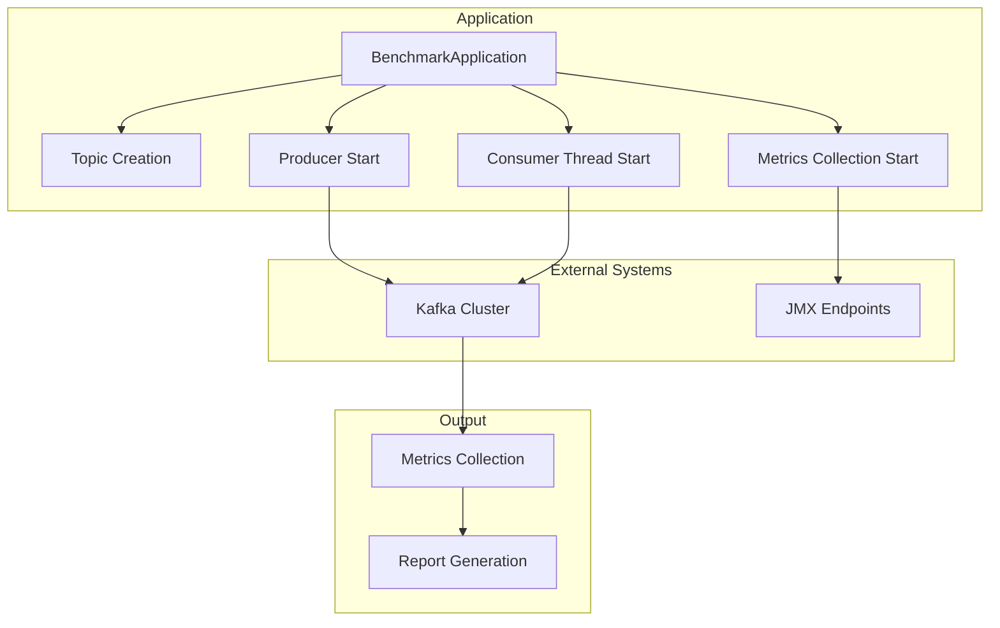

# Kafka Benchmarking POC - Project Structure

This document provides a comprehensive overview of the project structure and all files included in the Kafka Partitioning Strategy Benchmark POC.

## Overall Directory Structure

```
kafka-throughput-benchmarking/
├── Documentation Files
├── Build Configuration Files
├── Source Code
│   ├── Main Application
│   ├── Configuration
│   ├── Kafka Management
│   ├── Key Generation
│   ├── Producer
│   ├── Consumer
│   ├── Metrics Collection
│   ├── Reporting
│   └── Testing
├── Scripts
└── Output Directories
```

## Detailed File Structure

### Documentation Files
- `README.md` - Main project documentation with build and run instructions
- `DESIGN.md` - Architecture and design documentation
- `KAFKA_SETUP.md` - Kafka setup guide for testing
- `SUMMARY.md` - Project summary and key findings
- `PROJECT_STRUCTURE.md` - This file
- `kafka benchmarking poc.md` - Original PRD document

### Build Configuration Files
- `pom.xml` - Maven build configuration
- `build.gradle` - Gradle build configuration
- `gradle.properties` - Gradle properties
- `init.gradle` - Gradle initialization script

### Source Code

#### Main Application
- `src/main/java/com/example/kafkabenchmark/BenchmarkApplication.java` - Main entry point with CLI parsing

#### Configuration
- `src/main/java/com/example/kafkabenchmark/config/BenchmarkConfig.java` - Configuration class

#### Kafka Management
- `src/main/java/com/example/kafkabenchmark/kafka/TopicManager.java` - Topic creation/deletion

#### Key Generation
- `src/main/java/com/example/kafkabenchmark/key/KeyGenerator.java` - Key generator interface
- `src/main/java/com/example/kafkabenchmark/key/KeyGeneratorFactory.java` - Key generator factory
- `src/main/java/com/example/kafkabenchmark/key/LowCardinalityKeyGenerator.java` - Low cardinality implementation
- `src/main/java/com/example/kafkabenchmark/key/HighCardinalityKeyGenerator.java` - High cardinality implementation

#### Producer
- `src/main/java/com/example/kafkabenchmark/producer/BenchmarkProducer.java` - Throttled Kafka producer

#### Consumer
- `src/main/java/com/example/kafkabenchmark/consumer/BenchmarkConsumer.java` - Concurrent Kafka consumer

#### Metrics Collection
- `src/main/java/com/example/kafkabenchmark/metrics/JmxMetricsCollector.java` - JMX metrics collection

#### Reporting
- `src/main/java/com/example/kafkabenchmark/report/ReportGenerator.java` - Report generation

#### Testing
- `src/test/java/com/example/kafkabenchmark/key/LowCardinalityKeyGeneratorTest.java` - Low cardinality key generator tests
- `src/test/java/com/example/kafkabenchmark/key/HighCardinalityKeyGeneratorTest.java` - High cardinality key generator tests

### Scripts
- `check-environment.bat` - Environment verification script
- `compile-manual.bat` - Manual compilation script
- `package-jar.bat` - JAR packaging script
- `build-manual.bat` - Complete manual build script
- `run-benchmark.bat` - Single scenario runner
- `run-scenarios.bat` - Both scenarios runner
- `verify-setup.bat` - Setup verification script
- `build.bat` - Simple build helper
- `build.sh` - Simple build helper (Linux/Mac)

### Configuration Files
- `src/main/resources/logback.xml` - Logging configuration

### Output Directories
- `target/` - Maven build output directory
- `lib/` - External dependencies (created during build)
- `build/` - Gradle build output directory (created during build)

## Component Relationships



## Build Process Flow



## Runtime Architecture



## Key Design Principles

1. **Modularity**: Each component has a single responsibility
2. **Extensibility**: Easy to add new key generation strategies or metrics
3. **Configuration-driven**: All behavior controlled through CLI parameters
4. **Resource Management**: Proper cleanup of Kafka clients and JMX connections
5. **Error Handling**: Graceful degradation and meaningful error messages
6. **Performance**: Efficient use of resources and proper throttling

## Dependencies

### Runtime Dependencies
- Kafka Clients 3.6.0
- Picocli 4.7.5
- HdrHistogram 2.1.12
- OpenCSV 5.7.1
- SLF4J 2.0.9
- Logback 1.4.11

### Development Dependencies
- JUnit 4.13.2 (for testing)

## File Count Summary

- **Documentation**: 6 files
- **Build Configuration**: 4 files
- **Source Code**: 11 files
- **Tests**: 2 files
- **Scripts**: 9 files
- **Configuration**: 1 file
- **Output Directories**: 3 directories

**Total**: 36 files and 3 directories